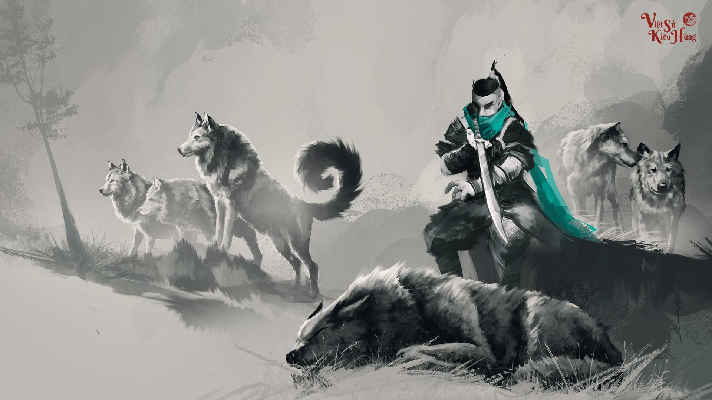

# Home


Link to [download](https://prod-notion-assets.s3-us-west-2.amazonaws.com/front/shared/illustrations/team-features-illustration.png).

**Red or blue color?**

_Blue or nope_


## Official Account

### This is the second title

#### And the third title

\#\#\#\# Oh, can not be the 4th title

[ View this post on Instagram](https://www.instagram.com/p/_HdjWFIaGq/?utm_source=ig_embed&utm_campaign=loading)

[A post shared by Lightix \(@lubnw\_\_\_\)](https://www.instagram.com/p/_HdjWFIaGq/?utm_source=ig_embed&utm_campaign=loading) on Dec 10, 2015 at 7:37am PST

| 1st | 2nd | 3rd |
| :--- | :--- | :--- |
| Content | Content | Content |
| [https://www.notion.so/Notion-Template-Gallery-181e961aeb5c4ee6915307c0dfd5156d](https://www.notion.so/Notion-Template-Gallery-181e961aeb5c4ee6915307c0dfd5156d) | [https://www.notion.so/Notion-Template-Gallery-181e961aeb5c4ee6915307c0dfd5156d](https://www.notion.so/Notion-Template-Gallery-181e961aeb5c4ee6915307c0dfd5156d) | [https://www.notion.so/Notion-Template-Gallery-181e961aeb5c4ee6915307c0dfd5156d](https://www.notion.so/Notion-Template-Gallery-181e961aeb5c4ee6915307c0dfd5156d) |
| [https://prod-notion-assets.s3-us-west-2.amazonaws.com/front/shared/illustrations/team-features-illustration.png](https://prod-notion-assets.s3-us-west-2.amazonaws.com/front/shared/illustrations/team-features-illustration.png) | [https://open.spotify.com/track/1Huy9G87D6pbIveFulsH0P?si=MhMfTFM5QVOZGdmpvYPwxQ](https://open.spotify.com/track/1Huy9G87D6pbIveFulsH0P?si=MhMfTFM5QVOZGdmpvYPwxQ) |  |


> The only thing I did not know is you



* [ ] Checklist
  * [ ] Long
  * [ ] Short
* [ ] Example
  * [ ] Yes
  * [ ] No








```text
just some sample code row
    if you are right
        you right
```



Yeap





Nope







meo meo

---

* Eight
  * Nine
    * Ten
    * Eleven
  * Seven
  * Six
* Five
  * Four
  * Three
  * Two
    * One
    * Zero

1. No
2. Yes
3. Right














API How to get free drink





















```

```





$$
a = b/2 +16*4
$$


